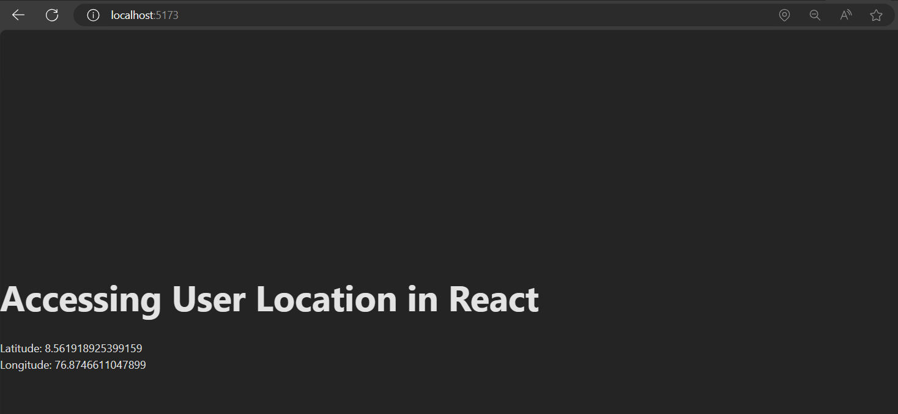

# React Location Access Demo

In the modern world of the internet, finding out where a user is located can be really useful for online applications. It helps in showing information that is specific to their area, offering services based on their location, and making the overall experience better. Knowing where users are can add a lot of useful features and make a React application more personalized and helpful for them.

To access the user's location in React, we can leverage the Geolocation API, which is a built-in feature in modern web browsers. The Geolocation API allows websites to retrieve the user's geographical location. Let's walk through an example implementation using the Geolocation API.



First, create a new React component called `LocationComponent`:

```js
import React, { useEffect, useState } from 'react';

const LocationComponent = () => {
  const [latitude, setLatitude] = useState(null);
  const [longitude, setLongitude] = useState(null);

  useEffect(() => {
    if (navigator.geolocation) {
      navigator.geolocation.getCurrentPosition(
        (position) => {
          setLatitude(position.coords.latitude);
          setLongitude(position.coords.longitude);
        },
        (error) => {
          console.error(error);
        }
      );
    } else {
      console.error('Geolocation is not supported by this browser.');
    }
  }, []);

  return (
    <div>
      Latitude: {latitude}
      <br />
      Longitude: {longitude}
    </div>
  );
};

export default LocationComponent;
```

In the LocationComponent component, we make use of React's useEffect and useState hooks. The useEffect hook is responsible for fetching the user's location when the component mounts. Inside the useEffect hook, we check if the browser supports the Geolocation API using `navigator.geolocation`. If supported, we call `navigator.geolocation.getCurrentPosition` to get the user's current position. If successful, the latitude and longitude values are set using the setLatitude and setLongitude functions respectively. If there's an error, it is logged to the console.

Finally, we render the latitude and longitude values in the JSX.

To use this LocationComponent in your application, import and include it in your desired location within your React component hierarchy:

```js
import LocationComponent from './components/LocationComponent';

function App() {

  return (
    <div>
      <h1>Accessing User Location in React</h1>
      <LocationComponent />
    </div>
  );
}

export default App
```

In the example above, we import the LocationComponent and include it within the App component. When the App component renders, it will display the `LocationComponent`, which will fetch and display the user's latitude and longitude.

Remember to handle cases where the user denies permission or when geolocation is not supported by their browser. You can provide fallback options or alternative features in such scenarios to ensure a smooth user experience.